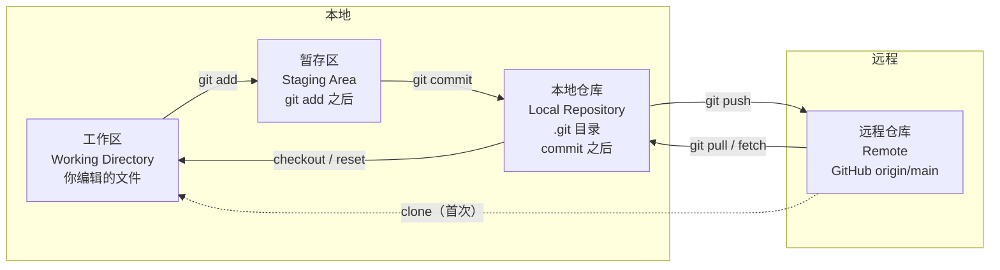
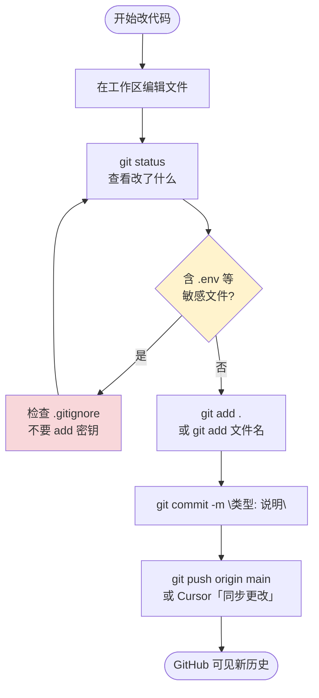
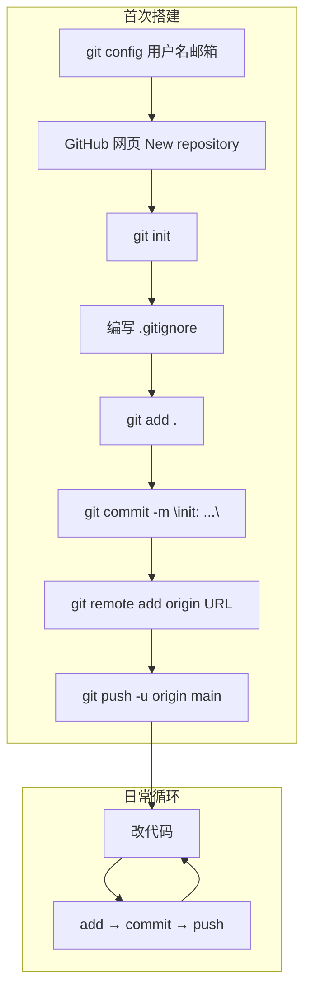
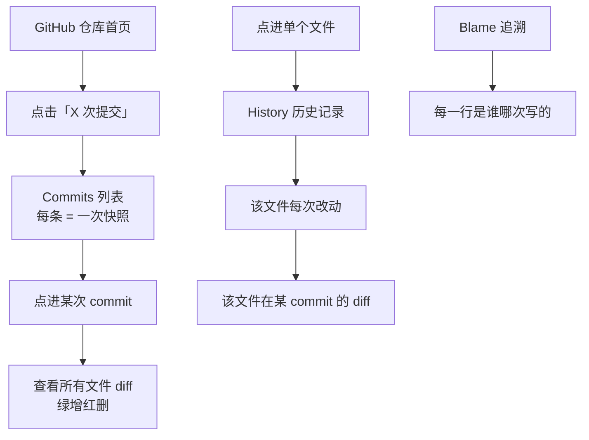
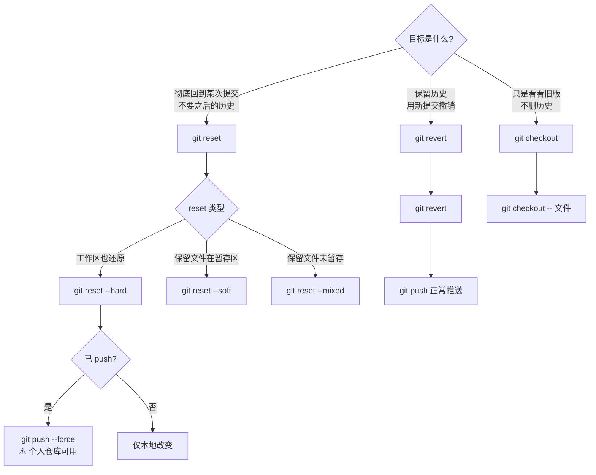
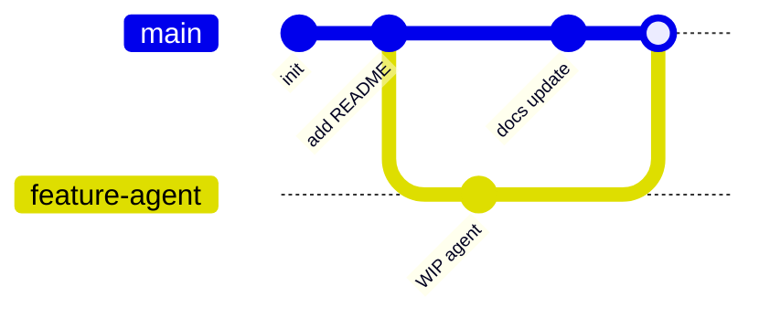
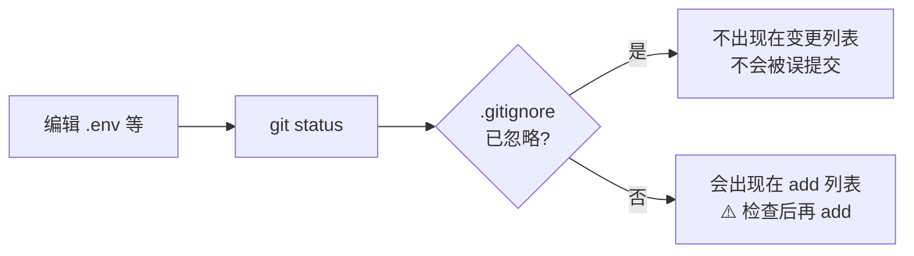
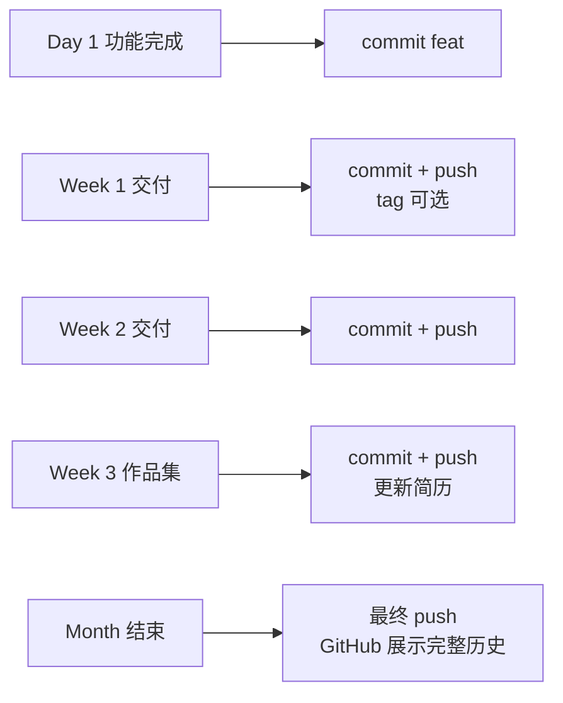

# Git 整体逻辑与命令速查

> 面向本仓库日常使用：本地开发 → 提交 → 推送 GitHub → 查看历史 → 回退  
> 配套实践仓库：[my-projects](https://github.com/ganzhongxue111/my-projects)

---

## 一、Git 是什么：四层存储架构

Git 不是「云盘」，而是**带历史的版本管理系统**。数据在四个区域之间流动：



| 区域 | 是什么 | 常用命令 |
|------|--------|----------|
| **工作区** | 磁盘上能直接编辑的文件 | 编辑器保存 |
| **暂存区** | 下次 commit 的「购物车」 | `git add` |
| **本地仓库** | `.git` 里的完整历史 | `git commit` |
| **远程仓库** | GitHub 上的副本 | `git push` / `git pull` |

---

## 二、一次完整日常流程（最常用）



### 对应命令（复制即用）

```powershell
cd "d:\job hunting"

git status                              # 1. 看状态
git add .                               # 2. 暂存（或 git add 具体文件）
git commit -m "feat: 实现 chat_basic"   # 3. 本地提交
git push origin main                    # 4. 推到 GitHub
```

### Cursor 中文界面对照

| Git 命令 | Cursor 操作 |
|----------|-------------|
| `git status` | 源代码管理面板查看变更列表 |
| `git add` | 文件旁点 **+** 或暂存全部更改 |
| `git commit` | 输入说明 → 点 **提交** |
| `git push` | 点 **同步更改**（↻） |

---

## 三、项目生命周期：从 0 到 GitHub



| 步骤 | 命令 | 说明 |
|------|------|------|
| 配置身份 | `git config --global user.name "名"`<br>`git config --global user.email "邮箱"` | 只做一次 |
| 初始化 | `git init` | 当前目录变仓库 |
| 关联远程 | `git remote add origin https://github.com/用户/仓库.git` | 只做一次 |
| 首次推送 | `git branch -M main`<br>`git push -u origin main` | `-u` 绑定 upstream |
| 之后推送 | `git push` | 已绑定后可直接 push |

---

## 四、Commit 历史：如何「看」



| 目的 | 本地命令 | GitHub 网页 |
|------|----------|-------------|
| 提交列表 | `git log --oneline` | Commits 页 |
| 某次改动详情 | `git show <commit>` | 点进 commit |
| 单文件历史 | `git log -- 文件路径` | 文件 → History |
| 谁改了某行 | `git blame 文件路径` | Blame |

**示例（你的仓库）：**

```
ad3bbb4  init: Day 0 环境搭建与学习文档
0c7c1f3  docs: add root README ...   ← 若存在则为第二次
```

---

## 五、回退：三种策略架构



### 5.1 场景对照表

| 场景 | 推荐命令 | 历史是否保留 | 远程 |
|------|----------|--------------|------|
| 撤销最近一次 commit，保留文件 | `git reset --soft HEAD~1` | 删除该 commit | 需 force push |
| 回到第一次提交，文件也还原 | `git reset --hard ad3bbb4` | 删除之后 commit | 需 force push |
| 已 push，安全撤销 README 那次 | `git revert 0c7c1f3` | 保留 + 新增撤销 commit | 正常 push |
| 误操作救回 | `git reflog` → `git reset --hard <hash>` | 可恢复 | — |

### 5.2 `HEAD` 与 `HEAD~1`

```
HEAD      → 当前所在 commit（最新）
HEAD~1    → 上一个 commit
HEAD~2    → 上上个 commit
```

---

## 六、分支（进阶，了解即可）



| 命令 | 作用 |
|------|------|
| `git branch` | 列出分支 |
| `git checkout -b 新分支` | 创建并切换 |
| `git merge 分支名` | 合并到当前分支 |

**现阶段建议：** 个人学习仓库只在 `main` 上 commit + push 即可。

---

## 七、`.gitignore` 在流程中的位置



**两大作用：**

1. **轻量** — 忽略 `__pycache__`、模型、日志等大文件  
2. **安全** — 忽略 `.env` 密钥，避免推到 GitHub  

提交前 habit：

```powershell
git status
git check-ignore -v .env    # 确认 .env 被忽略
```

---

## 八、命令速查总表

### 8.1 日常

| 命令 | 作用 |
|------|------|
| `git status` | 工作区 / 暂存区状态 |
| `git add .` | 暂存所有改动 |
| `git add 路径` | 暂存指定文件 |
| `git commit -m "msg"` | 提交到本地仓库 |
| `git push` | 推送到远程 |
| `git pull` | 拉取并合并远程更新 |
| `git log --oneline` | 简洁历史 |
| `git diff` | 未暂存的改动 |
| `git diff --staged` | 已暂存、未 commit 的改动 |

### 8.2 远程

| 命令 | 作用 |
|------|------|
| `git remote -v` | 查看远程地址 |
| `git clone URL` | 克隆他人仓库 |
| `git fetch` | 只下载远程更新，不合并 |

### 8.3 撤销 / 回退

| 命令 | 作用 |
|------|------|
| `git restore 文件` | 丢弃工作区改动 |
| `git restore --staged 文件` | 从暂存区撤出 |
| `git reset --soft HEAD~1` | 撤销 commit，保留暂存 |
| `git reset --hard <commit>` | 硬回退到指定 commit |
| `git revert <commit>` | 新建 commit 撤销某次 |
| `git reflog` | 找回「丢失」的 commit |

### 8.4 Commit 信息规范（本仓库）

```
init:  初始化
feat:  新功能
fix:   修 bug
docs:  文档
test:  测试
```

---

## 九、本仓库推荐 Git 节奏



- 每完成一个小功能 → **一次 commit**  
- 每周末 → **push** 到 GitHub  
- push 前 → **`git status` 确认无 .env**

---

## 十、常见问题

| 问题 | 处理 |
|------|------|
| `fatal: not a git repository` | `cd` 到项目根目录 |
| `Permission denied (push)` | 检查 GitHub Token / 登录 |
| 误 add 了 `.env` | `git restore --staged .env`，确认 .gitignore |
| push 被拒绝（远程有新提交） | `git pull --rebase origin main` 再 push |
| reset 后后悔了 | `git reflog` 找 hash 再 reset 回去 |

---

*文档版本：v1.0 | 位于 `md/git-工作流程与命令.md`*
